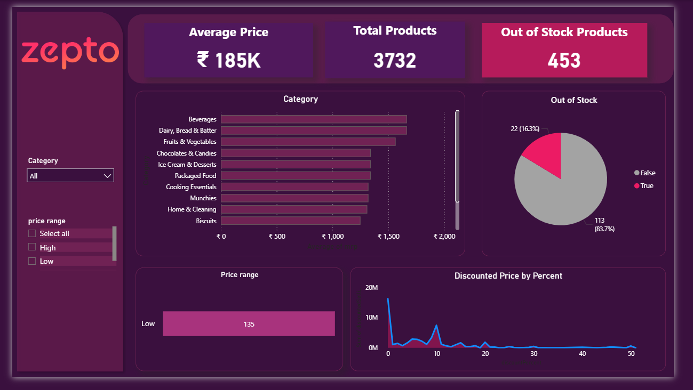

# Zepto Data Analysis Project

## Overview
This project analyzes product data from Zepto using SQL and Power BI.

## Tools Used
- SQL (MySQL)
- Power BI

## Key Insights
- High-priced products are mainly oils and baby products
- Personal care category has highest average price
- Most products are in stock
- Majority products fall in medium to high price range
## The Dashboard

## Files
- zepto.csv → dataset
- zepto_analysis.sql → SQL queries
- zepto_dashboard.pbix → Power BI dashboard
